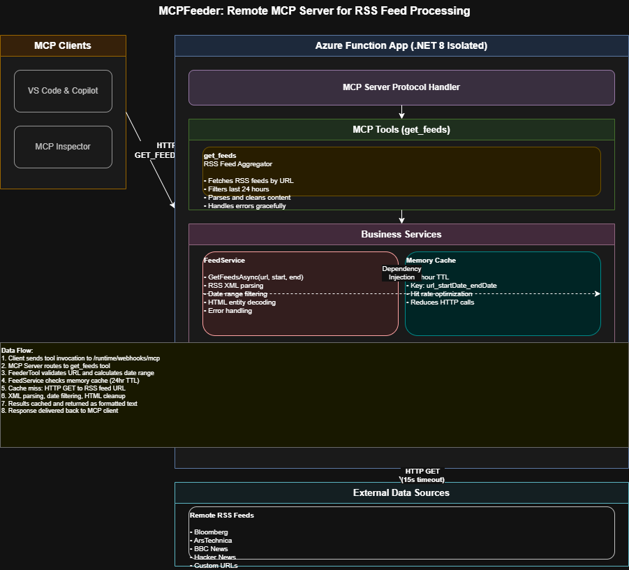

<!--
---
name: Remote MCP with Azure Functions (.NET/C#) - RSS Feed Aggregator
description: Run a remote MCP server on Azure functions for dynamic RSS feed processing and AI integration.  
page_type: sample
languages:
- csharp
- bicep
- azdeveloper
products:
- azure-functions
- azure
urlFragment: remote-mcp-functions-dotnet-feeder
---
-->

# MCPFeeder: Remote MCP Server for RSS Feed Aggregation using Azure Functions (.NET/C#)

MCPFeeder is a production-ready **Model Context Protocol (MCP) server** built on **Azure Functions** that enables AI agents (like GitHub Copilot) to dynamically fetch and process **RSS feeds** from multiple sources in real-time. This quickstart template allows you to build, test locally with full debugging, and deploy your custom MCP server to the cloud in minutes.

The server is **secured by design** using API keys and HTTPS, with additional support for OAuth via EasyAuth, API Management policies, and optional network isolation using VNETs.

## Key Features of MCPFeeder

### RSS Feed Processing Tool (`get_feeds`)
The core MCP tool provided by MCPFeeder:

- **Dynamic Feed Fetching**: Retrieve RSS feed content from any URL passed as a parameter
- **Temporal Filtering**: Automatically extracts feed items from the **last 24 hours** (from midnight previous day to midnight current day)
- **Intelligent Caching**: In-memory caching with **24-hour TTL** to optimize performance and reduce external HTTP calls
- **Robust Parsing**: 
  - Handles standard RSS XML format with proper namespace support
  - Extracts: title, content, links, and publication dates
  - Automatically cleans HTML tags from descriptions
  - Decodes HTML entities for clean content
- **Error Handling**: Graceful degradation with informative error messages (no exceptions thrown to client)
- **Timeout Protection**: 15-second timeout on HTTP requests to prevent hanging
- **Logging & Observability**: Full Application Insights integration for debugging and monitoring

### Example Tool Invocation

```plaintext
Tool Name: get_feeds
Description: Feeds data from a specified URL.

Parameter: Url (required)
Description: The URL to fetch data from.

Example:
  Input:  https://example.com/feed.xml
  Output: [Yesterday's feed items with title, content, link, and publish date]
```

**Watch the video overview**

<a href="https://www.youtube.com/watch?v=XwnEtZxaokg">
  
</a>

If you're looking for this sample in other languages, check out the [Node.js/TypeScript](https://github.com/Azure-Samples/remote-mcp-functions-typescript) and [Python](https://github.com/Azure-Samples/remote-mcp-functions-python) samples.  

[](https://codespaces.new/artcava/MCPFeeder)

## Prerequisites

### Required for all development approaches:
+ [.NET 8 SDK](https://dotnet.microsoft.com/download/dotnet/8.0)
+ [Azure Functions Core Tools](https://learn.microsoft.com/azure/azure-functions/functions-run-local?pivots=programming-language-csharp#install-the-azure-functions-core-tools) >= `4.0.7030`
+ [Azure Developer CLI](https://aka.ms/azd) (for deployment)

### For Visual Studio development:
+ [Visual Studio 2022](https://visualstudio.microsoft.com/vs/)
+ Make sure to select the **Azure development** workload during installation

### For Visual Studio Code development:
+ [Visual Studio Code](https://code.visualstudio.com/)
+ [Azure Functions extension](https://marketplace.visualstudio.com/items?itemName=ms-azuretools.vscode-azurefunctions)

> **Choose one**: You can use either Visual Studio OR Visual Studio Code. Both provide full debugging support, but the setup steps differ slightly.

## Architecture Overview

Below is the architecture diagram for the MCPFeeder Remote MCP Server using Azure Functions:



### Component Architecture

MCPFeeder implements a **layered architecture** specifically optimized for RSS feed processing:

| Layer | Component | Responsibility |
|-------|-----------|----------------|
| **Client Layer** | MCP Clients (VS Code, Copilot, MCP Inspector) | Sends HTTP requests to fetch feeds |
| **Transport** | HTTP/HTTPS Protocol | Secure communication with system key authentication |
| **Runtime** | Azure Functions Worker (.NET 8 Isolated) | Serverless compute platform |
| **MCP Protocol** | MCP Server | Routes tool invocations and manages protocol |
| **Tool Layer** | `FeederTool.FeedUrl()` | Exposes `get_feeds` as MCP tool |
| **Business Logic** | `FeedService.GetFeedsAsync()` | RSS parsing, filtering, and caching |
| **Cache Layer** | IMemoryCache (in-process) | 24-hour TTL for feed data |
| **External Integration** | HTTP Client to Feed URLs | Fetches RSS feeds from remote sources |

### Request-Response Flow

```
┌─────────────────────────────────────────────────────────────┐
│ MCP Client (Copilot, MCP Inspector, Custom Tools)         │
│ Request: tool/call "get_feeds" with URL parameter         │
└──────────────────────┬──────────────────────────────────────┘
                       │
                       ▼
┌─────────────────────────────────────────────────────────────┐
│ HTTPS Request to Azure Functions                           │
│ POST /runtime/webhooks/mcp?code=<system_key>             │
│ Content: JSON-RPC 2.0 tool invocation                     │
└──────────────────────┬──────────────────────────────────────┘
                       │
                       ▼
┌─────────────────────────────────────────────────────────────┐
│ Azure Functions Worker (Runtime)                           │
│ .NET 8 Isolated Worker Process                           │
└──────────────────────┬──────────────────────────────────────┘
                       │
                       ▼
┌─────────────────────────────────────────────────────────────┐
│ MCP Server                                                  │
│ Routes to: FeederTool.FeedUrl()                           │
└──────────────────────┬──────────────────────────────────────┘
                       │
                       ▼
┌─────────────────────────────────────────────────────────────┐
│ FeederTool.FeedUrl()                                        │
│ • Validates URL parameter                                  │
│ • Calculates date range (last 24 hours)                   │
│ • Calls FeedService.GetFeedsAsync()                       │
└──────────────────────┬──────────────────────────────────────┘
                       │
                       ▼
┌─────────────────────────────────────────────────────────────┐
│ FeedService.GetFeedsAsync()                                 │
│ Step 1: Check Memory Cache (24hr TTL)                     │
│         ✓ Cache Hit → Return cached feeds                │
│         ✗ Cache Miss → Proceed to step 2                 │
└──────────────────────┬──────────────────────────────────────┘
                       │
                       ▼
┌─────────────────────────────────────────────────────────────┐
│ HTTP Client (15s timeout)                                  │
│ Fetches RSS feed from provided URL                        │
└──────────────────────┬──────────────────────────────────────┘
                       │
                       ▼
┌─────────────────────────────────────────────────────────────┐
│ XML Parser                                                  │
│ • Parse RSS XML document                                   │
│ • Extract items with pubDate, title, description, link    │
│ • Filter items by date (last 24 hours only)              │
│ • Clean HTML tags from descriptions                       │
│ • Decode HTML entities                                    │
└──────────────────────┬──────────────────────────────────────┘
                       │
                       ▼
┌─────────────────────────────────────────────────────────────┐
│ Memory Cache                                                │
│ Save parsed RSSFeed objects with 24-hour TTL              │
└──────────────────────┬──────────────────────────────────────┘
                       │
                       ▼
┌─────────────────────────────────────────────────────────────┐
│ Return Response                                             │
│ Formatted text: [Title]\n[Content]\n[Link]\n[Date]\n\n... │
│ Or error message if parsing failed                         │
└──────────────────────┬──────────────────────────────────────┘
                       │
                       ▼
┌─────────────────────────────────────────────────────────────┐
│ JSON-RPC 2.0 Response                                       │
│ Returns to MCP Client (Copilot) with tool output          │
└──────────────────────┬──────────────────────────────────────┘
                       │
                       ▼
┌─────────────────────────────────────────────────────────────┐
│ MCP Client Processing                                       │
│ Integrates feed data into AI context for analysis          │
│ Can use for summarization, recommendations, etc.          │
└─────────────────────────────────────────────────────────────┘
```

### Data Model

Each RSS feed item is represented as an `RSSFeed` record:

```csharp
public record RSSFeed
{
    public required string Title { get; init; }           // Article headline
    public required string Content { get; init; }         // Cleaned description (no HTML)
    public required string Link { get; init; }            // URL to full article
    public DateTimeOffset PublishDate { get; init; }      // Publication timestamp
}
```

### Caching Strategy

- **Key**: `feeds_{url}_{startDate:yyyyMMdd}_{endDate:yyyyMMdd}`
- **TTL**: 24 hours
- **Hit Rate**: Optimizes requests when the same URL is queried within the same day
- **Storage**: In-process memory (scales with function instance)

### Security Architecture

- **Authentication**: Azure Functions system keys (default)
- **Transport**: HTTPS only in production
- **Authorization**: Optional OAuth via EasyAuth or API Management
- **Network**: Optional VNET isolation for private connectivity
- **Monitoring**: Full audit trail in Application Insights

## Prepare your local environment

An Azure Storage Emulator is needed for testing:

1. Start Azurite (Docker-based storage emulator):

    ```shell
    docker run -p 10000:10000 -p 10001:10001 -p 10002:10002 \
        mcr.microsoft.com/azure-storage/azurite
    ```

>**Note**: If you use Azurite from the VS Code extension, run `Azurite: Start` command, otherwise you may see connection errors.

## Run your MCP Server locally

Choose your preferred development environment:

### Option A: Using Visual Studio Code

#### Run from Terminal
1. From the `src` folder, start the Functions host locally:

    ```shell
    cd src
    func start
    ```

The server will be available at: `/runtime/webhooks/mcp` on `http://localhost:7071`

Note: When deployed to Azure, you'll use this same route with a system key: `/runtime/webhooks/mcp?code=<system_key>`

### Option B: Using Visual Studio

1. Open `MCPFeeder.sln` in Visual Studio 2022
2. Set `MCPFeeder` as the startup project
3. Press **F5** to start debugging
4. The Functions host will start and listen on `http://localhost:7071/runtime/webhooks/mcp`

## Connect to your *local* MCP server from client tools

Once your Azure Functions MCP server is running locally, you can connect from various MCP client tools:

### Using VS Code with GitHub Copilot

1. **Add MCP Server** from the command palette (`Ctrl+Shift+P` → "Add MCP Server")
2. Enter the URL: `http://localhost:7071/runtime/webhooks/mcp`
3. **List MCP Servers** from the command palette and start the server
4. In Copilot chat agent mode, enter a prompt to invoke the tool. Example prompts:

    ```plaintext
    Get the latest news from https://feeds.bloomberg.com/markets/news.rss
    ```

    ```plaintext
    Fetch tech news from https://feeds.arstechnica.com/arstechnica/index
    ```

    ```plaintext
    Retrieve yesterday's feeds from https://example.com/rss.xml and summarize them
    ```

5. When prompted to run the tool, click **Continue**
6. To stop the server, press **Ctrl+C** in the terminal

### Using MCP Inspector (Advanced Testing)

MCP Inspector is a web-based tool for testing MCP servers:

1. In a **new terminal window**, install and run MCP Inspector:

    ```shell
    npx @modelcontextprotocol/inspector
    ```

2. Open the URL displayed by the tool (e.g., `http://0.0.0.0:5173`)
3. Set the transport type to **Streamable HTTP**
4. Enter the URL: `http://0.0.0.0:7071/runtime/webhooks/mcp` (or `http://localhost:7071/runtime/webhooks/mcp/sse` for Visual Studio)
5. Click **Connect**
6. Click **List Tools** to see available tools
7. Select **get_feeds**, enter a feed URL, and click **Run Tool**

### Testing the `get_feeds` Tool Locally

Example RSS feed URLs for testing:

- Bloomberg Markets: `https://feeds.bloomberg.com/markets/news.rss`
- ArsTechnica: `https://feeds.arstechnica.com/arstechnica/index`
- HN Top: `https://news.ycombinator.com/rss`
- BBC News: `http://feeds.bbc.co.uk/news/rss.xml`
- Hacker News Search: `https://hnrss.org/newest`

## Troubleshooting Local Development

**Problem**: Connection refused when trying to connect to MCP server
- **Solution**: Ensure Azurite is running:
  ```shell
  docker run -p 10000:10000 -p 10001:10001 -p 10002:10002 mcr.microsoft.com/azure-storage/azurite
  ```

**Problem**: Wrong URL (0.0.0.0 vs localhost)
- **Solution**: Use `http://0.0.0.0:7071/runtime/webhooks/mcp` for VS Code, `http://localhost:7071/runtime/webhooks/mcp/sse` for Visual Studio

**Problem**: Visual Studio F5 doesn't work
- **Solution**: Ensure the Azure development workload is installed and `MCPFeeder` project is set as startup project

**Problem**: Feed returns "No feeds found for the specified URL and time range"
- **Solution**: This means the RSS feed was fetched successfully but had no items from yesterday. Try with a different feed URL or check that your system date/time is correct.

**Problem**: Timeout errors when fetching feeds
- **Solution**: Some feeds may be slow. The tool has a 15-second timeout. If a feed consistently times out, consider adding it to a blocklist or increasing timeout (requires code modification).

## Deploy to Azure for Remote MCP

### Provision and Deploy

Run the following [azd](https://aka.ms/azd) command to provision all required Azure resources and deploy your code:

```shell
az login
azd up
```

This will:
- Create a resource group
- Provision an Azure Function App (.NET Isolated runtime)
- Create a Storage Account for optional blob storage
- Set up Application Insights for monitoring
- Deploy your code to the cloud

### Optional: Enable VNet Isolation

For improved security with network isolation:

```bash
azd env set VNET_ENABLED true
azd up
```

This creates your MCP server within a private Virtual Network with restricted access.

### Optional: Add API Management

For advanced security policies and rate limiting, integrate API Management:

```bash
azd env set APIM_ENABLED true
azd up
```

See [API Management with MCP](https://github.com/Azure-Samples/remote-mcp-apim-functions-python) for more details.

## Connect to your *remote* MCP server from a client

Your client needs the system key to invoke the remote MCP endpoint: `https://<funcappname>.azurewebsites.net/runtime/webhooks/mcp`

### Get your system key

Retrieve the `mcp_extension` system key using:

**Option 1: Azure Portal**
1. Open your Function App in the Azure Portal
2. Navigate to **Functions** → **App keys**
3. Copy the **mcp_extension** key value

**Option 2: Azure CLI**
```bash
az functionapp keys list --resource-group <resource-group-name> --name <function-app-name>
```

Look for the key with description `mcp_extension`.

### Connect in MCP Inspector

Include the key in the URL:
```plaintext
https://<funcappname>.azurewebsites.net/runtime/webhooks/mcp?code=<your-mcp-extension-system-key>
```

### Connect in VS Code - GitHub Copilot

For Copilot in VS Code, set the key as a header in `mcp.json`. The config file is already in the repository:

```json
{
    "inputs": [
        {
            "type": "promptString",
            "id": "functions-mcp-extension-system-key",
            "description": "Azure Functions MCP Extension System Key",
            "password": true
        },
        {
            "type": "promptString",
            "id": "functionapp-name",
            "description": "Azure Functions App Name"
        }
    ],
    "servers": {
        "remote-mcp-function": {
            "type": "http",
            "url": "https://${input:functionapp-name}.azurewebsites.net/runtime/webhooks/mcp",
            "headers": {
                "x-functions-key": "${input:functions-mcp-extension-system-key}"
            }
        },
        "local-mcp-function": {
            "type": "http",
            "url": "http://0.0.0.0:7071/runtime/webhooks/mcp"
        }
    }
}
```

When you click **Start** on the server, VS Code will prompt you for the function app name and system key.

## Redeploy your code

After making changes, redeploy with:

```shell
azd up
```

You can run this command as many times as needed. It will:
1. Build your updated code
2. Upload the deployment package
3. Update your Function App with the latest version

>[!NOTE]
>Deployed code files are always overwritten by the latest deployment package.

## Clean up resources

When done, delete all resources to avoid incurring charges:

```shell
azd down
```

## Source Code Structure

### Main Components

**`src/Tools/FeederTool.cs`** - The core MCP Tool
```csharp
[Function(nameof(FeedUrl))]
public async Task<string> FeedUrl(
    [McpToolTrigger("get_feeds", "Feeds data from a specified URL.")] 
    ToolInvocationContext context,
    [McpToolProperty("Url", "The URL to fetch data from.")] 
    string url)
{
    // Fetch feeds for the last 24 hours
    // Returns formatted text with title, content, link, and date
}
```

**`src/Services/FeedService.cs`** - RSS Feed Processing Logic
- `GetFeedsAsync(url, start, end)`: Fetches and parses RSS feeds
- Implements intelligent caching with 24-hour TTL
- Filters feeds by date range
- Cleans HTML and decodes entities
- Handles errors gracefully

**`src/Models/RSSFeed.cs`** - Data Model
```csharp
public record RSSFeed
{
    public required string Title { get; init; }
    public required string Content { get; init; }
    public required string Link { get; init; }
    public DateTimeOffset PublishDate { get; init; }
}
```

**`src/Program.cs`** - Dependency Injection & Configuration
- Configures Azure Functions runtime
- Registers `FeedService` as a transient dependency
- Enables Application Insights telemetry

### Infrastructure

**`infra/main.bicep`** - Infrastructure as Code
- Defines Azure resources (Function App, Storage, App Insights)
- Supports optional VNet isolation
- Supports optional API Management integration

**`MCPFeeder.sln`** - Visual Studio Solution
- References all projects and their dependencies

## Extending MCPFeeder

### Add More MCP Tools

1. Create a new file in `src/Tools/` (e.g., `WebScraperTool.cs`)
2. Define a function with `[Function]` and `[McpToolTrigger]` attributes
3. Register dependencies in `Program.cs` if needed
4. Add tool definitions to `src/Tools/ToolsDefinitions.cs`

### Enhance Feed Processing

- **Add feed filtering**: Filter by category, keyword, or sentiment
- **Extend date range**: Make it configurable instead of hardcoded "last 24 hours"
- **Support Atom feeds**: In addition to RSS
- **Add feed source registry**: Maintain a list of vetted feed URLs

### Improve Performance

- **Use distributed caching**: Replace in-memory cache with Azure Cache for Redis
- **Implement rate limiting**: Prevent abuse of the endpoint
- **Add feed prioritization**: Process popular feeds first

### Add Security Features

- **URL validation**: Whitelist allowed feed domains
- **Request signing**: Implement HMAC-SHA256 signatures
- **Feed validation**: Verify RSS schema before processing

## Security Considerations

- **API Keys**: System keys are required by default; consider adding EasyAuth for OAuth
- **HTTPS Only**: Always use HTTPS in production
- **Rate Limiting**: Implement in API Management to prevent abuse
- **VNet Isolation**: Use `VNET_ENABLED=true` for network isolation
- **URL Validation**: Consider blocking requests to internal/private IP ranges
- **Timeout Protection**: Built-in 15-second timeout prevents hanging requests

## Monitoring & Logging

MCPFeeder integrates with **Azure Application Insights** for full observability:

```shell
# View logs in Azure Portal
Azure Portal → Your Function App → Monitoring → Logs

# Or use Azure CLI
az monitor app-insights query --app <app-insights-name> --analytics-query "traces | where message contains 'FeedUrl'"
```

Key log points:
- Feed fetch requests and URLs
- Cache hits/misses
- Parsing errors
- Feed content statistics

## Technology Stack

- **.NET 8.0**: Modern, high-performance runtime
- **Azure Functions**: Serverless computing on Azure
- **C#**: Type-safe, feature-rich language
- **Bicep**: Infrastructure as Code for Azure
- **Application Insights**: Cloud-native monitoring
- **Azure Storage**: Optional persistence layer

## License

This project is licensed under the MIT License. See [LICENSE.md](LICENSE.md) for details.

## Contributing

Contributions are welcome! Please see [CONTRIBUTING.md](CONTRIBUTING.md) for guidelines.

## Related Resources

- [Model Context Protocol Official Docs](https://modelcontextprotocol.io)
- [Azure Functions Documentation](https://learn.microsoft.com/en-us/azure/azure-functions/)
- [Azure Developer CLI (azd)](https://learn.microsoft.com/en-us/azure/developer/azure-developer-cli/)
- [MCP Server Examples from Microsoft](https://github.com/microsoft/mcp/tree/main/Resources)
- [Remote MCP Python Sample](https://github.com/Azure-Samples/remote-mcp-functions-python)
- [Remote MCP TypeScript Sample](https://github.com/Azure-Samples/remote-mcp-functions-typescript)

## Next Steps

1. **Deploy to Azure**: Run `azd up` to get your server in the cloud
2. **Test with Copilot**: Connect your VS Code instance and use the `get_feeds` tool
3. **Add More Tools**: Implement additional MCP tools following the `FeederTool` pattern
4. **Secure with API Management**: Add policies for rate limiting and request validation
5. **Monitor with App Insights**: Track usage and performance in the Azure Portal

## Support

For issues or questions:
- Check the [Troubleshooting](#troubleshooting-local-development) section
- Open an issue on [GitHub Issues](https://github.com/artcava/MCPFeeder/issues)
- Refer to [Contributing Guidelines](CONTRIBUTING.md)
